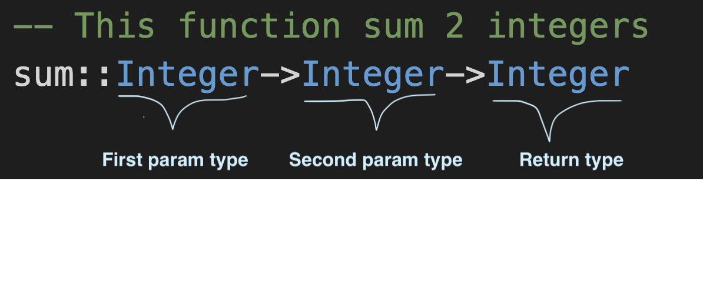

Acerca de como “invocar” a Haskell, le pediremos que ejecute nuestro script `ejem1.hs`, pero lo haría adentro de la consola de Haskell.
Por lo que habría que salirse de la consola o terminal ghci para regresar a la consola o terminal del sistema. Y aún tenemos otra opción para ejecutar un script y esta consiste en abrir la consola de Haskell y adentro de ella “cargar” el script con `load “ejem1.hs`

Pero de aquí preferimos el comando “Haskell” para ejecutar un script. Ahora hagamos un programa que defina una función que tome dos enteros como argumento y regrese la suma de ambos.

Ahora:

> En Haskell si no indicamos el tipo de una variable o función, Haskell intentará deducirlo el mismo...