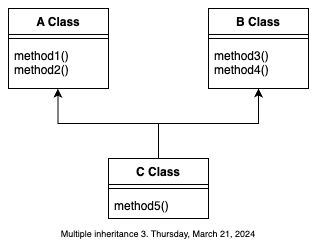

Si insistimos en que necesitamos la funcionalidad de una clase abstracta en Ruby, para eso están los módulos que no son otra cosa que un conjunto de métodos agrupados:

```rb
module module_name
    def method1(arg1)
        # This method does nothing
    end
    
    def method2(arg1, arg2)
        # This does nothing
    end
    
    def method3
        # This does nothing
    end
end
```

Nótese que
1. Ninguno de los métodos hace nada, están vacíos por que la idea es que aquella clase que los incluya los va a definir a su manera.
2. Cada método puede o no tomar parámetros de entrada. Pero si le definimos parámetros aquella clase que lo incluya deberá respetar esoos par++ametros que le fueron originalmente definidos.

Sin embargo es totalmente factible definir en un módulo un método con todo y sus instrucciones solo que ese método y esas instrucciones son incluidas como tales en la clase que lo incluya, y no deberá redefinir esas instrucciones porque si lo hace habrá redefinido todo el método. Ahora, cuando una clase debe incluir un módulo lo hará así:
```rb
class class_name
    include class_module

    .
    .
    .

    # Definition of the methods of the module
    def method1(arg1)
        return arg1+10
    end
    def method2(arg1, arg2)
        return arg1+arg2
    end
    def method3
        return 1221
    end
end
```
Es posible que una clase incluya un módulo pero solo defina alguno de los métodos en ella, pero no todos.

> En Ruby un módulo es como una clase abstracta porque el módulo solo contiene métodos abstractos (o virtuales) que son definidos en la clase que lo incluye.

Y la herencia múltiple en Ruby

En primer lugar sépase que 

> En Ruby no existe la herencia múltiple

La razón es que Ruby considera que la herencia múltiple trae consigo más problemas que beneficios, sobre todo en lo referente al conflicto de nombres, es decir, la situación en donde dos o más clases base le heredan a la clase derivada un mismo atributo ó un mismo método. Pero si insistimos en que queremos herencia múltiple entonces debemos conocer que:
> En Ruby la funcionalidad de la herencia múltiple la podemos lograr con módulos, otra vez.
> Solo téngase en en cuidado con esta funcionalidad por que estaríamos hablando de la herencia de métodos exclusivamente. La idea es sencilla, la funcionalidad de la siguiente relación de herencia.



Esto en Ruby lo podemos lograr como:
```rb
module class_A
    def method_1
        # instructions here
    end
    def method_2
        # instructions here
    end
end

module class_B
    def method_3
        # instructions here
    end
    def method_4
        # instructions here
    end
end

module class_C
    include class_A
    include class_B

    def method_5
        # instructions here
    end
end
```
Así, un objeto de tipo `class_C`contiene todos los métodos en `clase_A`,`clase_B` y `clase_C`.

Y sin embargo, debemos conocer lo siguiente:

> Aún usando inclusión de módulos podemos tener conflictos de nombres

Si, por ejemplo, dos módulos diferentes tienen definido un mismo método y luego 

> Ruby se queda con la primer versión del método que reciba.

Es decir, con la versión del primer módulo que incluyó y que contiene al método en conflicto.