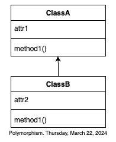

# Polimorfismo (de métodos)
Y llegamos al último concepto clave detrás del POO, el polimorfismo.

Aunque:
> En este curso nos enfocamos en el llamado polimorfismo de métodos.

Es decir que para nosotros lo que es polimórfico son los métodos. Y así decimos que:

> Un método es polimórfico si tiene la capacidad de comportarse coherente de acuerdo al objeto en que está definido.

Es decir que el método hará lo que tenga que hacer de acuerdo al "tipo de objeto del objeto en donde reside.

Luego, el polimorfismo en métodos es algo que ocurre de 2 maneras:
1. Redefiniendo un método heredado
2. O definiendo múltiples versiones del ismo método en una clase.

### Polimorfismo en métodos heredados.
Supongase la siguiente relación de herencia:



Aquí la clase `ClassB`recibe por herencia al método `method1()`pero en lugar de usarlo así como lo recibió, mejor lo rdefine para adaptarlo a sus necesidades.
Entonces:
> El método `method1()` de `ClassA` es diferente al `method1()`de `ClassB`pero ambos son el `method1()`, luego, `method1()`es polimórfico.

- El método `move()` de un objeto tipo `Point1D`y el de un objeto tipo `Point2D` es uno polimórfico.

```rb
class Point1D
    def initialize(valX)
        @x=valX
    end
    attr accessor: x
    def move(deltaX)
        @x+=deltaX
    end
end
class Point2D<Point1D
    def initialize(valX, valY)
        super(valX)
        @y=valY
    end
    attr accessor: y
    def move(deltaX, deltaY)
        super(deltaX)
        @y=deltaY
    end
end
```

Aquí claramente al `move()`de `Point1D`y el `move()` de `Point2D` son diferentes:
1. En `Point1D`, `move()` desplaza al punto en el eje x
2. En `Point2D`, `move()` desplaza al punto en el eje xy en el eje y

Por lo tanto aqui `move()` is polymorphic.

# Polimorfismo por definición múltiple

Algunos lenguajes de programación que soportan POO admiten la definición de un mismo método más de una vez, en tanto difieran en el tipo y/o cantidad de parámetros, pero:
> Ruby no permite que existan múltiples versiones de un mismo método

Ni si quiera si utilizamos distintos argumentos Ruby lo permitirá.

Sin embargo, en Ruby existe algo llamado **DuckTyping** que permite hacer algo parecido a esto,

### Duck Typing (tipeado de pato)
Es un estilo de codificación en Ruby en donde definimos un método que manda a llamar al método del mismo nombre de un objeto de un tipo muy específico.

La idea es que el primer objeto es muy general, y tiene un método con un nombre que manda a llamnar un método con el mismo nombre pero de un objeto muy específico.

- Denuevo con `Point1D` y `Point2D` pero ligeramente modificado:

```rb
class Point1D
    def initialize(valX)
        @x=valX
    end
    attr accessor: x
    def getCoords()
        return @x
    end
end
class Point2D<Point1D
    def initialize(valX, valY)
        super(valX)
        @y=valY
    end
    attr accessor: y
    def getCoords()
        return @x, @y
    end
end
```
Hasta aquí el método `getCoords()` es polimórfico por redefinición de herencia. Luego nos inventamos una clase más como la siguiente:

```rb
class GeneralPoint
    def getCoords(point)
        return point.getCoords()
    end
end
```
Esta clase nomás sirve para "leer" las coordenadas de un punto, sin importar su tipo, así que:
> En este ejemplo getCoords() es polimórfico por Duck typing.


```rb
def ppal
    p1=Point2D.new(10)
    p2=Point2D.new(20,20)
    p3=GeneralPoint()
    x=p3.getCoords(p1) # Polymorphism by DuckTyping
    puts "La coordenada en x es %d" %[x]
    x,y=p3.getCoords(p3) # Polymorphism by DuckTyping
    puts "Las coordenadas en X y en Y son %d, %d" %[x,y]
end
```